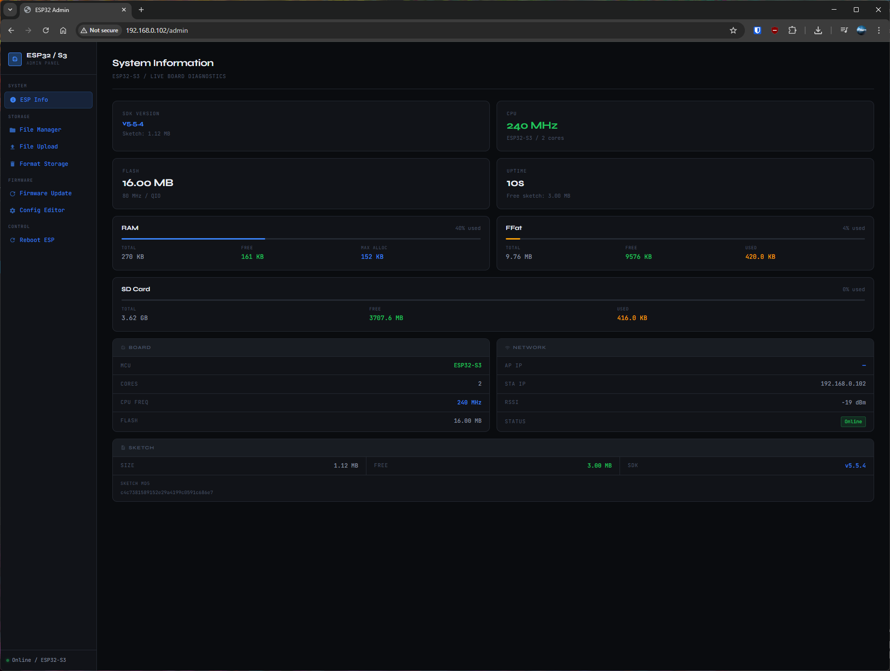
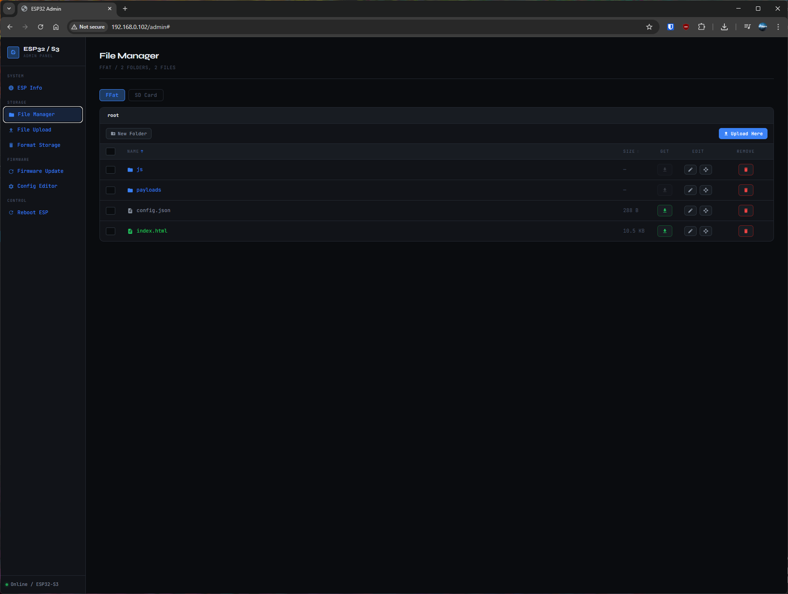
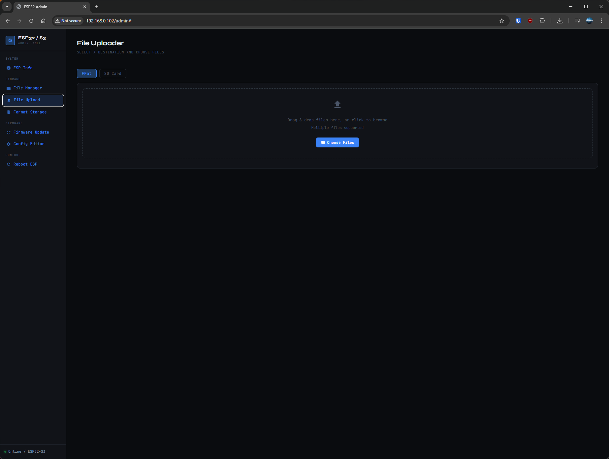
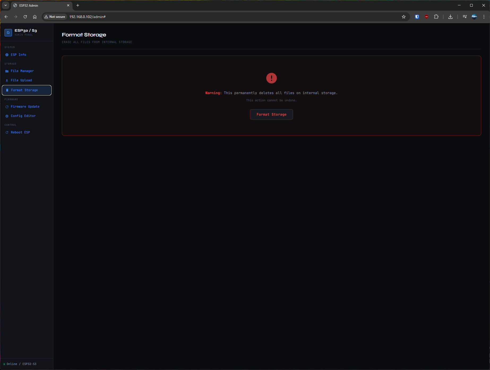
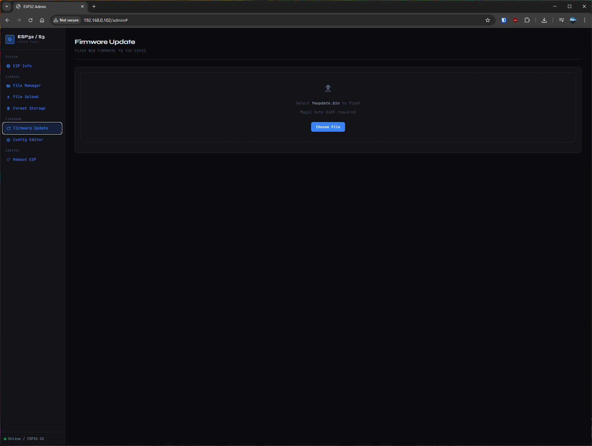
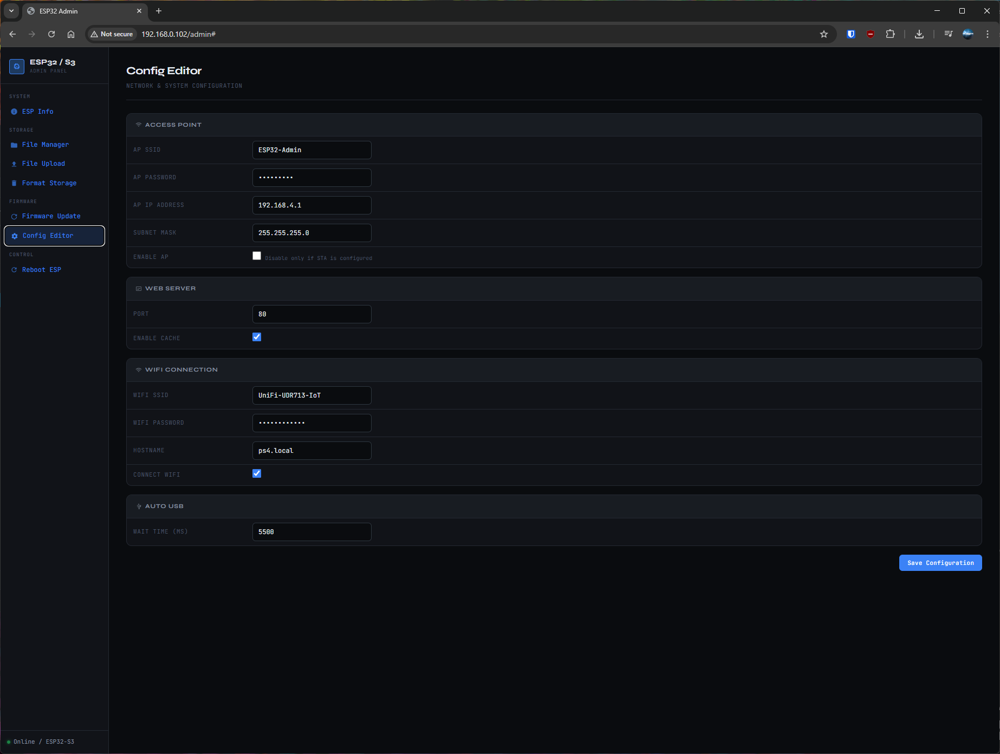
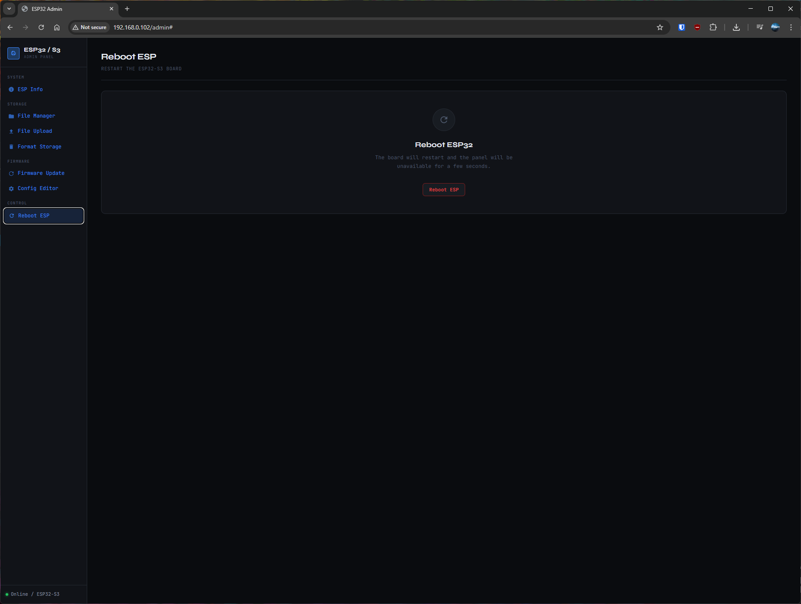

# ESP32-S3 Web Server


## Supported boards
### Tested with the following boards:
 - Waveshare ESP32-S3-Zero [(link)](https://www.waveshare.com/wiki/ESP32-S3-Zero/)
 - Waveshare ESP32-S3-GEEK [(link)](https://www.waveshare.com/wiki/ESP32-S3-GEEK/)

*Any ESP32-S2/S3 should work providing it has OTG mode*

Uncomment the correct board in `config.h` before compiling.

---

## Arduino IDE settings — Waveshare ESP32-S3-Zero

| Setting | Value |
|---|---|
| Board | ESP32S3 Dev Module |
| Flash Size | **4MB (32Mb)** |
| Partition Scheme | **Default 4MB with spiffs** |
| Flash Mode | QIO 80MHz |
| PSRAM | **QSPI PSRAM** |
| CPU Frequency | 240MHz |
| USB CDC On Boot | **Enabled** ← critical |
| USB Mode | Hardware CDC and JTAG |
| Upload Speed | 921600 |

---

## Arduino IDE settings — Waveshare ESP32-S3-GEEK

| Setting | Value |
|---|---|
| Board | ESP32S3 Dev Module |
| Flash Size | **16MB (128Mb)** |
| Partition Scheme | **16M Flash (3MB APP/9.9MB FATFS)** |
| Flash Mode | QIO 80MHz |
| PSRAM | **OPI PSRAM** |
| CPU Frequency | 240MHz |
| USB CDC On Boot | **Enabled** ← critical |
| USB Mode | Hardware CDC and JTAG |
| Upload Speed | 921600 |

> **Note:** To use PS4 USB MSC (`/api/usb/on`), change USB CDC On Boot → **Disabled** and USB Mode → **USB-OTG**. This disables Serial monitor. OTA still works over WiFi.

---

## First time upload (both boards)
Both boards use native USB — no USB-UART chip.
1. Hold **BOOT** → plug in USB-C → release BOOT
2. Upload sketch in Arduino IDE
3. Press **RESET** to run
4. Open Serial Monitor @ 115200 to see AP credentials and IP

---

## Libraries (Arduino Library Manager)
| Library | Author |
|---|---|
| ESPAsyncWebServer | me-no-dev |
| AsyncTCP | me-no-dev |
| ArduinoJson >= 7.x | Benoit Blanchon |

---

## Project structure
```
ESP32S3_WebServer/
├── ESP32S3_WebServer.ino   main firmware
├── config.h                board selection + WiFi credentials
├── admin_panel.h           AUTO-GENERATED — do not edit
├── exfathax.h              PS4 fake ExFAT image for USB MSC
├── build_panel.py          run this to regenerate admin_panel.h
└── data/
    ├── admin.html          SPA admin panel (all pages in one file)
    └── style.css           admin panel CSS
```

---

## Workflow
```
1. Edit config.h          — select board, set credentials
2. Edit data/admin.html   — customise admin panel if needed
3. python build_panel.py  — regenerates admin_panel.h
4. Upload sketch in Arduino IDE
```
No LittleFS plugin. No esptool. No partition math.

---

## Admin panel
Browse to `http://<board-ip>/admin` after connecting to the AP.

The admin panel is a Single Page Application — all pages load instantly with no iframe overhead. Pages included:
- **ESP Info** — live board diagnostics, RAM/storage bars, network status
- **File Manager** — browse, upload, download, rename, copy, move, delete files and folders on InternalFS and SD
- **File Upload** — multi-file upload with per-file progress bars
- **Format Storage** — erase InternalFS
- **Firmware Update** — OTA flash with progress + auto-reconnect
- **Config Editor** — WiFi, AP, USB and sleep settings with restart detection
- **Reboot ESP** — soft reboot with countdown and auto-reconnect

---

## Filesystems
| Board | Filesystem | API param | Notes |
|---|---|---|---|
| S3-Zero | LittleFS | `fs=lfs` | ~1.4MB free |
| S3-GEEK | InternalFS (FFat) | `fs=lfs` | ~9.9MB free |

Both boards support an optional SD card (`fs=sd`). SD takes priority over InternalFS for `index.html` and `config.json`.

### Enabling SD card
Uncomment `#define USE_SD` in `config.h`.
- **S3-GEEK**: fixed pins (CS=34, SCK=36, MISO=37, MOSI=35)
- **S3-Zero**: wire a breakout to any free GPIOs and update the defines in `config.h`

---

## Root page priority
Requesting `/` or `/index.html`:
1. SD `/index.html` — if SD enabled and file exists
2. InternalFS `/index.html` — if file exists
3. PROGMEM admin panel — fallback

Upload your own `index.html` to take over the root. Delete it to restore the admin panel.

---

## Cache.manifest
Requesting `/Cache.manifest` generates a manifest dynamically by scanning both InternalFS and SD. The manifest includes a hash of all file sizes — when any file changes the hash changes, triggering a PS4 AppCache update automatically. `.json` files are excluded from the cache (always served live).

---

## API endpoints
| Endpoint | Method | Description |
|---|---|---|
| `/api/status` | GET | Live board JSON |
| `/api/config` | GET | Read config JSON |
| `/api/files?fs=lfs\|sd&path=/` | GET | File/folder list |
| `/api/delete?fs=lfs\|sd&path=/x` | DELETE | Delete file or folder (recursive) |
| `/api/download?fs=lfs\|sd&path=/x` | GET | Download file |
| `/api/upload/lfs/path/` | POST | Upload to InternalFS at path |
| `/api/upload/sd/path/` | POST | Upload to SD at path |
| `/api/mkdir` | POST | Create folder |
| `/api/copy` | POST | Copy a file to a location |
| `/api/rename` | POST | Rename a file or folder |
| `/api/usb/on` | POST | Enable PS4 USB MSC (ExFAT exploit) |
| `/api/usb/off` | POST | Disable USB MSC + reboot |
| `/Cache.manifest` | GET | Dynamic AppCache manifest |
| `/config.html` | POST | Save config (reboots if WiFi changed) |
| `/update.html` | POST | OTA firmware flash |
| `/format.html` | POST | Format InternalFS + reboot |
| `/reboot.html` | POST | Reboot |

## Preview Images






